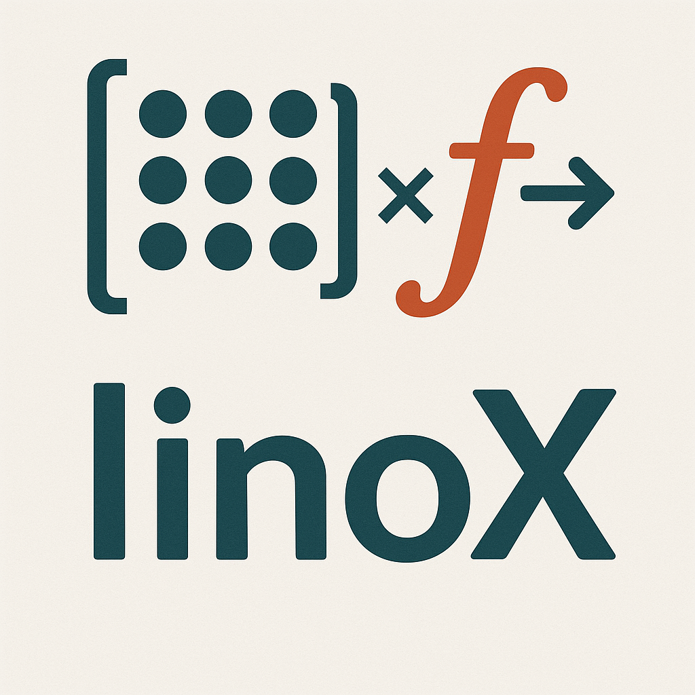
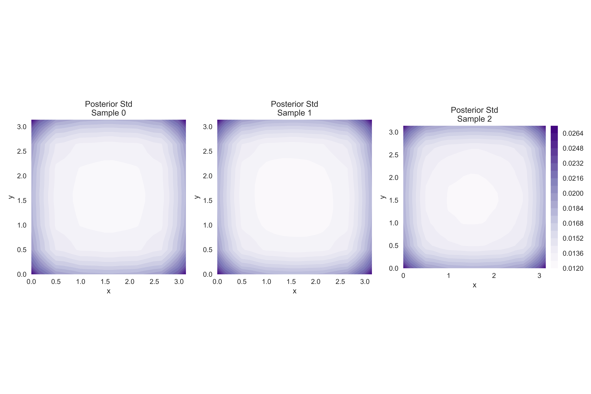

<div align="center">
  
</div>

# `linox`: Linear Operators in JAX

`linox` is a Python package that provides a collection of linear operators for JAX, enabling efficient and flexible linear algebra operations with lazy evaluation. This package is designed as an JAX alternative to [`probnum.linops`](https://probnum.readthedocs.io/en/latest/api/linops.html), but it is currently still under development having less and more instable features. It has no dependencies other than [JAX](https://github.com/jax-ml/jax) and [`plum`](https://github.com/beartype/plum) for multiple dispatch.

<div align="center">
  <picture>
    
  </picture>
  <picture>
    
  </picture>
  <br/>
  <sub>Matrix‑free Gaussian Process predictions and posterior uncertainty on a 2D heat‑equation task using Kronecker‑structured kernels.</sub>
  <br/>
</div>

## Features

- **Lazy Evaluation**: All operators support lazy evaluation, allowing for efficient computation of complex linear transformations
- **JAX Integration**: Built on top of JAX, providing automatic differentiation, parallelization, JIT compilation, and GPU/TPU support
- **Composable Operators**: Operators can be combined to form complex linear transformations

## Linear Operators

### Basic Operators
- `Matrix`: General matrix operator
- `Identity`: Identity matrix operator
- `Diagonal`: Diagonal matrix operator
- `Scalar`: Scalar multiple of identity
- `Zero`: Zero matrix operator
- `Ones`: Matrix of ones operator

### Block Operators
- `BlockMatrix`: General block matrix operator
- `BlockMatrix2x2`: 2x2 block matrix operator
- `BlockDiagonal`: Block diagonal matrix operator

### Low Rank Operators
- `LowRank`: General low rank operator
- `SymmetricLowRank`: Symmetric low rank operator
- `IsotropicScalingPlusSymmetricLowRank`: Isotropic scaling plus symmetric low rank
- `PositiveDiagonalPlusSymmetricLowRank`: Positive diagonal plus symmetric low rank

### Special Operators
- `Kronecker`: Kronecker product operator
- `Permutation`: Permutation matrix operator
- `EigenD`: Eigenvalue decomposition operator

## Benefits of JAX Integration

- **Automatic Differentiation**: Compute gradients automatically through operator compositions
- **JIT Compilation**: Speed up computations with just-in-time compilation
- **Vectorization**: Efficient batch processing of linear operations via e.g. `jax.vmap`
- **GPU/TPU Support**: Run computations on accelerators without code changes
- **Functional Programming**: Pure functions enable better optimization and parallelization

## Quick Example

```python
import jax
import jax.numpy as jnp
from linox import Matrix, Diagonal, BlockMatrix

# Create operators
A = Matrix(jnp.array([[1, 2], [3, 4]], dtype=jnp.float32))
D = Diagonal(jnp.array([1, 2], dtype=jnp.float32))

# Compose operators
B = BlockMatrix([[A, D], [D, A]])

# Apply to vector
x = jnp.ones((4,), dtype=jnp.float32)
y = B @ x  # Lazy evaluation

# Parallelize over batch of vectors
x_batched = jnp.ones((10, 4), dtype=jnp.float32)
y_batched = jax.vmap(B)(x_batched)
```

## Gaussian Process Operator (Matrix‑Free, Kronecker Structured)

Linox makes it easy to build Gaussian Process (GP) operators that factorize across
function and spatial dimensions. This leverages Kronecker structure and preserves
matrix‑free behavior, so you can compose large kernels without materializing
massive dense arrays.

Example: a modular GP prior with a function kernel ⊗ spatial kernel

```python
import jax
import jax.numpy as jnp
from helper.new_gp import (
    CombinationConfig,
    DimensionSpec,
    ModularGPPrior,
    StructureConfig,
    params_from_structure,
)
from helper.gp import KernelType, CombinationStrategy

# Enable double precision for numerical stability (optional)
jax.config.update("jax_enable_x64", True)

# 2D setup (one function dim u, two spatial dims x,y)
structure = StructureConfig(
    spatial_dims=[
        DimensionSpec(name="x", kernel_type=KernelType.RBF),
        DimensionSpec(name="y", kernel_type=KernelType.RBF),
    ],
    function_dims=[DimensionSpec(name="u", kernel_type=KernelType.L2)],
)
combo = CombinationConfig(strategy=CombinationStrategy.ADDITIVE, output_scale=1.0)
prior = ModularGPPrior(structure, combo)
params = params_from_structure(structure)

# Training data (N_train functions, evaluated on an (nx, ny) grid)
N_train, N_test = 25, 3
nx, ny = 15, 15
nx_plot, ny_plot = 25, 25

# See helper.plotting.generate_preprocess_data_2d for data creation
from helper.plotting import generate_preprocess_data_2d
(
    operator_inputs,         # (N_train, nx, ny)
    spatial_inputs,          # (nx, ny, 2)
    outputs,                 # (N_train * nx * ny,)
    operator_inputs_test,    # (N_test, nx, ny)
    spatial_inputs_test,     # (nx, ny, 2)
    outputs_test,            # (N_test * nx * ny,)
    spatial_inputs_plot,     # (nx_plot, ny_plot, 2)
) = generate_preprocess_data_2d(
    x_range=(0.0, jnp.pi), y_range=(0.0, jnp.pi),
    nx=nx, ny=ny, T=0.1, alpha=0.5,
    N_train=N_train, N_test=N_test,
    nx_plot=nx_plot, ny_plot=ny_plot,
)

# Build the Kronecker‑structured kernel and run predictions
pred_mean_flat, pred_cov = prior.predict(
    operator_inputs,
    outputs,
    spatial_inputs,
    operator_inputs_test,
    spatial_inputs_plot,
    params,
)

# pred_mean_flat has shape (N_test * nx_plot * ny_plot,)
# pred_cov is a LinearOperator (matrix‑free) you can densify only for plotting
```

Why this is fast and memory‑efficient
- Kronecker structure: The prior kernel is built as `K_function ⊗ K_spatial`, using
  `linox.Kronecker`, so large grids are handled as compositions rather than dense
  matrices.
- Matrix‑free algebra: Solves and products are done via LinearOperators (e.g.,
  `IsotropicAdditiveLinearOperator`, `linverse`, `lsolve`) without forming dense blocks.
- Lazy properties: Many operations (like `diagonal`) propagate into factors and avoid
  densification unless explicitly required (see “Densification Warnings”).

Illustrative outputs (2D heat‑equation demo)


See the example notebook for a walkthrough: `examples/gp_operator_walkthrough.ipynb`.

## Densification Warnings and Debug Mode

Some operations fall back to dense computations when a lazy, structure‑preserving
path is not available (e.g., diagonal of a general product of non‑diagonal factors,
explicit inverse materialization). To help diagnose performance, `linox` can emit
warnings whenever an operation densifies.

By default, these warnings are suppressed. Enable them via the API or an
environment variable:

```python
from linox import set_debug

# Turn on debug warnings
set_debug(True)

# Turn them off again
set_debug(False)
```

Or set an environment variable before running Python:

```bash
export LINOX_DEBUG=1   # enables densification warnings
python your_script.py
```

Examples of operations that may warn when debug is enabled:
- `diagonal(op)` when it must convert an operator to dense to compute the diagonal.
- Decompositions like `leigh`, `svd`, `lqr` falling back to dense.
- `InverseLinearOperator.todense()` and pseudo‑inverse matmul paths that need dense.
- `Matrix.todense()` when explicitly materializing the dense array.

Note: Many structure‑aware paths remain lazy (e.g., diagonals of Kronecker
products and of diagonal‑like products). The warnings help ensure large operators
aren’t accidentally densified.
